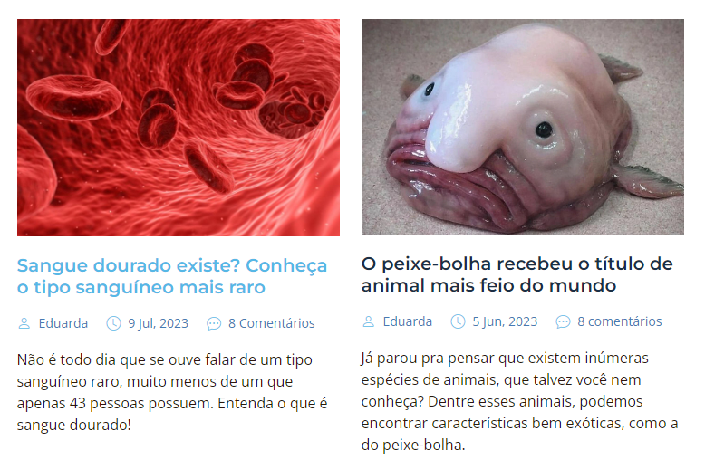
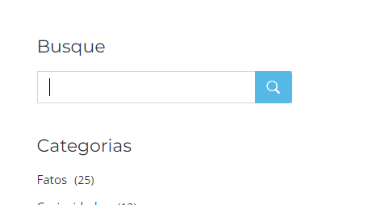
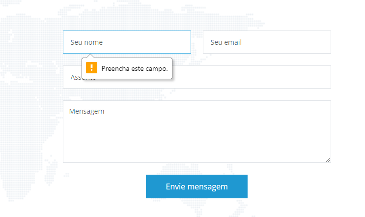
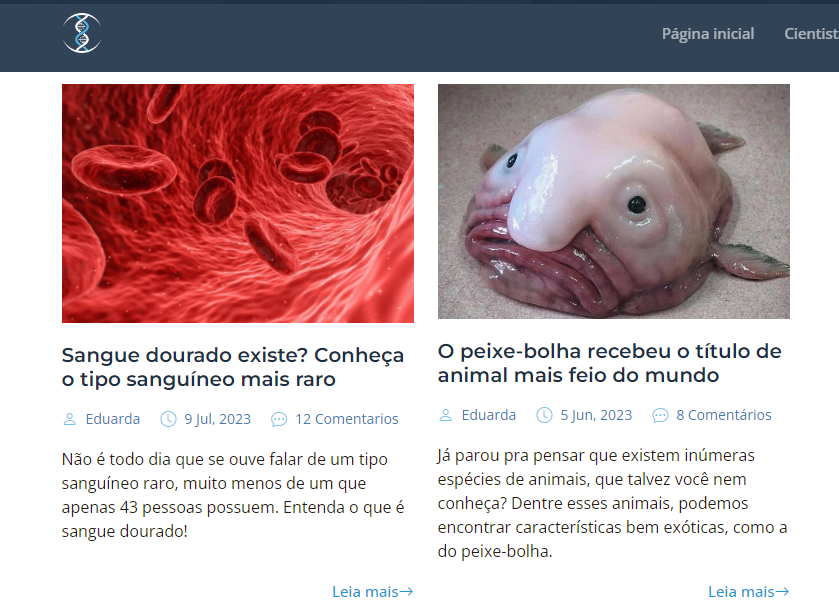

# Princípios de Design de Interação

## Visibilidade
O princípio de visibilidade diz que as funções do sistema devem estar dispostas de forma bem visível para que o usuário descubra a sua utilidade de forma simples, ou seja, quanto mais visível uma função estiver, mais os usuários irão notar. Esse princípio de Design de Interação foi bem aplicado no sistema pela mudança de cor quando o mouse passa por cima do título do post do blog, indicando que é um texto clicável.

<div align="center">



</div>

## Affordance
   
O princípio de Affordance está relacionado a atributos que um objeto tem e que indica a ideia da sua função. Foi trazido para o site na tela de blog, em que a lupa remete a uma associação de um objeto conhecido pelo usuário, remetendo a uma proximidade com a sua funcionalidade de pesquisar algo.

<div align="center">



</div>

## Feedback

O Feedback é a resposta que o usuário deve receber após efetuar alguma ação na interface. Tem-se o uso do princípio na tela de “contato”, em que se tem o retorno imediato para o usuário de que ele deixou de preencher informações necessárias.

<div align="center">



</div>

## Consistência

A Consistência é criar padrões dentro do sistema. O princípio é observado no site com a aplicação do padrão existente entre todos os posts: mesmo tamanho, formato, fonte, posicionamento.

<div align="center">



</div>

# Análise do código

A tag semântica `header` é utilizada para delimitar o cabeçalho de uma página ou páginas, apresentando normalmente a logo do sistema, links que redirecionam para outras páginas relacionadas ao site e barras de busca. É um suporte para guiar o usuário em meio ao que o sistema fornece, de acordo com subdivisões, vulgo páginas.

```
<!-- ======= Header ======= -->
  <header id="header" class="header d-flex align-items-center fixed-top">
    <div class="container-fluid container-xl d-flex align-items-center justify-content-between">


      <a href="index.html" class="logo d-flex align-items-center">
        <!-- Uncomment the line below if you also wish to use an image logo -->
        
      </a>


      <i class="mobile-nav-toggle mobile-nav-show bi bi-list"></i>
      <i class="mobile-nav-toggle mobile-nav-hide d-none bi bi-x"></i>


      <nav id="navbar" class="navbar">
        <ul>
          <li><a href="index.html">Página inicial</a></li>
          <li><a href="services.html">Cientistas em destaque</a></li>
          <li><a href="team.html">Equipe</a></li>
          <li><a href="blog.html" class="active">Blog</a></li>
          <li><a href="contact.html">Contato</a></li>
        </ul>
      </nav><!-- .navbar -->

    </div>
  </header><!-- End Header -->

```

A classe `navbar` agrupa as páginas que estarão no cabeçalho, na barra de navegação

```
<nav id="navbar" class="navbar">
        <ul>
          <li><a href="index.html">Página inicial</a></li>
          <li><a href="services.html">Cientistas em destaque</a></li>
          <li><a href="team.html">Equipe</a></li>
          <li><a href="blog.html" class="active">Blog</a></li>
          <li><a href="contact.html">Contato</a></li>
        </ul>
      </nav><!-- .navbar -->

```
A classe `d-flex` cria um container flexbox e define seus elementos filhos diretos em itens com display flex também.

A classe `align-items-center` centraliza os itens que estão dentro dos flex containers 

A classe `fixed-top` fixa um elemento no topo da tela, independente do deslizamento do usuário pelo scrollbar

```
<header id="header" class="header d-flex align-items-center fixed-top">

```
